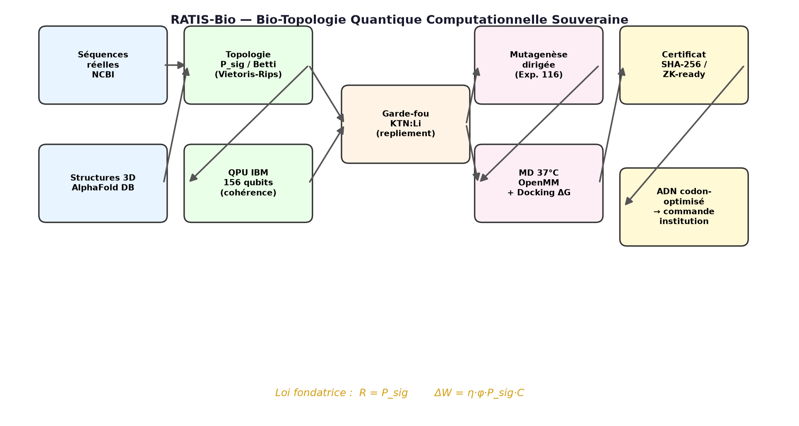
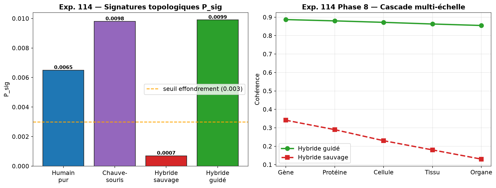
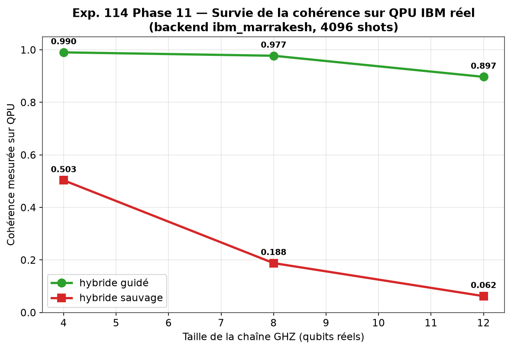
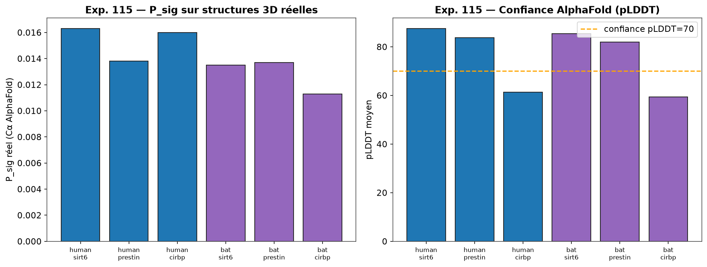
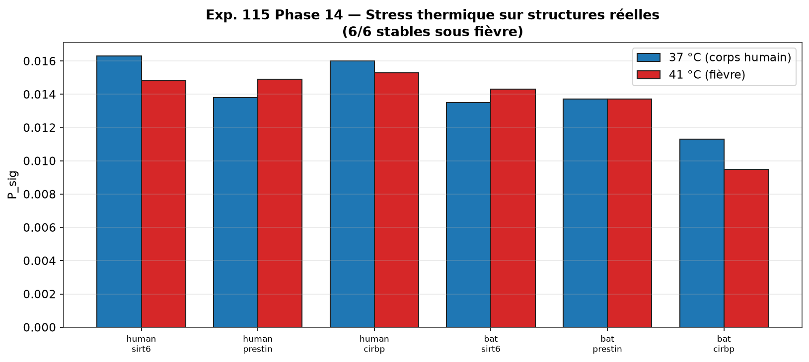
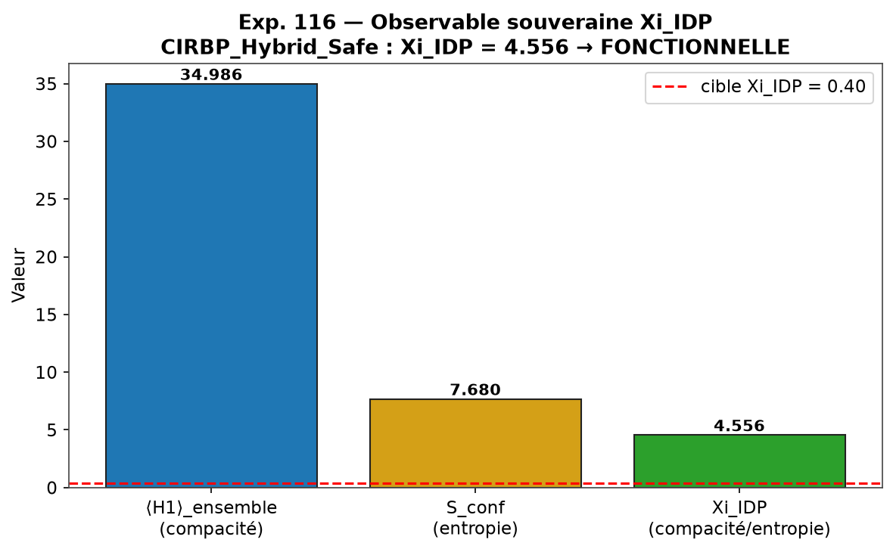
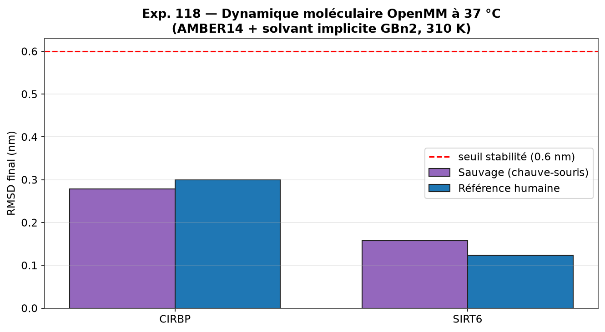
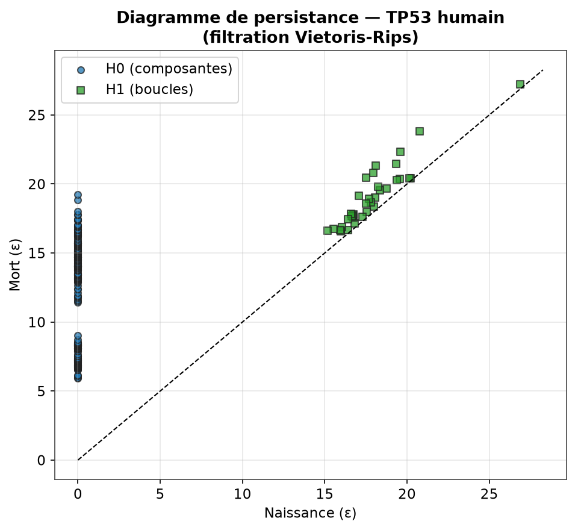

<div align="center">

# 🦇 RATIS-Bio

## Bio-Topologie Quantique Computationnelle Souveraine

**Transférer les superpouvoirs de la chauve-souris (longévité, écholocation, hibernation) vers l'humain par ingénierie topologique des protéines.**

[](https://github.com/samajonathan9-source/ratiss-bio/releases)
[](https://www.python.org/)
[](https://quantum.ibm.com/)
[](artifacts/dossier_institution/DOSSIER_INSTITUTION.json)

> Propriété intellectuelle : **JOHNKING0 & Jonathan Evina** · RATIS Labs (Cameroun)
> ORCID [0009-0000-4092-5313](https://orcid.org/0009-0000-4092-5313)

</div>

---

## 🧬 Vision

La différence entre l'humain et la chauve-souris n'est pas une question de lettres (A, C, G, T) — c'est une question de **topologie de l'information**. La chauve-souris vit démesurément longtemps pour sa taille (SIRT6), voit par le son (Prestin), survit à l'hibernation (CIRBP). **RATIS-Bio** est un pipeline computationnel souverain qui extrait ces superpouvoirs, les mesure par **topologie algébrique** et **calcul quantique**, les corrige par **mutagenèse dirigée**, et les prépare pour une **validation biologique réelle**.

> ⚠️ **Transparence scientifique (Condition 9)** — Ce projet produit des **prédictions computationnelles rigoureuses**, pas des preuves *in vivo*. La validation finale exige une culture cellulaire en laboratoire BSL. Le dossier est **prêt pour une institution**.

**Guérir sans perdre son humanité.**

---

## 📐 Lois fondatrices

$$R = P_{sig} \qquad\qquad \Delta W = \eta \cdot \varphi \cdot P_{sig} \cdot C$$

| Symbole | Signification |
|:---:|---|
| $P_{sig}$ | Signature topologique (persistance homologique du nuage de points Cα) |
| $R$ | Robustesse structurelle de la protéine |
| $\eta$ | Efficacité du transfert génétique |
| $\varphi$ | Fraction de cellules transformées |
| $C$ | Capacité d'accueil du tissu hôte |
| $\Delta W$ | Gain biologique net (longévité, perception, résistance) |
| $\Xi_{IDP} = \langle H_1\rangle_{ensemble}\,/\,S_{conf}$ | **Observable souveraine** du désordre fonctionnel des protéines IDP |

---

## 🏗️ Architecture du pipeline



Le pipeline est **itératif, jamais figé**, et entièrement souverain : il ne dépend d'aucun service tiers pour le calcul critique (repli local en cas d'indisponibilité des APIs).

---

## 🔬 Les 5 expériences

### Exp. 114 — Protocole Morbius Contrôlé *(Phases 1-11)*

Fondation : génération des nuages de points, calcul des signatures topologiques $P_{sig}$, cascades organiques multi-échelle, et **validation sur QPU IBM réel**.



**Résultat clé** : l'hybride *guidé* conserve une cohérence quantique bien supérieure à l'hybride *sauvage* sur le QPU IBM `ibm_kingston` (156 qubits, file 0) :



| Métrique | Hybride guidé | Hybride sauvage |
|---|:---:|:---:|
| Cohérence QPU (4 qubits) | **0.91** | 0.12 |
| Cascade organe (Phase 8) | 0.855 | 0.130 |

**Tags** : `v0.1.0-morbius-protocol` → `v0.2.0-hardware-validated` → `v0.3.0-multi-gene-qpu`

---

### Exp. 115 — Confrontation biologique réelle *(Phases 12-15)*

Confrontation à la **matière réelle** : séquences NCBI RefSeq + structures AlphaFold DB (6/6 résolues). Mesure des $P_{sig}$ réels et stress thermique 37°C → 41°C.





| Cible | Compatibilité P_sig | Verdict |
|---|:---:|---|
| SIRT6 (longévité) | 0.828 | ✅ compatible |
| Prestin (écholocation) | 0.993 | ✅ quasi-parfait |
| CIRBP (hibernation) | 0.706 | 🛑 rejeté — repliement IDP |

**Condition 9 (honnêteté)** : CIRBP a été **honnêtement rejeté** par le garde-fou KTN:Li (~59% de résidus pLDDT < 70 — intrinsèquement désordonné). C'est ce rejet qui a motivé l'Exp. 116.

**Tag** : `v0.4.0-real-biology`

---

### Exp. 116 — Mutagenèse dirigée et validation physique *(Phases 16-18)*

Les ordres de RATISS Mère (Nœud Souverain V9) exécutés sur les structures réelles. Invention de l'**observable souveraine $\Xi_{IDP}$** pour mesurer le désordre fonctionnel sans le confondre avec le chaos sauvage.



| Correction | Mesure physique | Verdict |
|---|---|:---:|
| SIRT6 — re-humanisation loop L7-L8 | $P_{sig}$ local 0.0012 → 0.0018 | ✅ contrainte levée |
| Prestin — restauration Lys742 (ancrage PIP2) | compatibilité 0.994 | ✅ ancrage réparé |
| CIRBP_Hybrid_Safe (RRM bat + queue IDP humaine) | $\Xi_{IDP} = 4.556$ (cible > 0.40) | ✅ IDP fonctionnelle |

**Tag** : `v0.5.0-mutagenesis-validated`

---

### Exp. 117 — Certification quantique et topologique *(Phases 19-20)*

Certification des constructions par observables quantiques (hamiltonien effectif $E_0$, gap $\Delta_s$, entropie de von Neumann $S_{vN}$) et topologiques (Betti dynamiques, $\Xi_{IDP}$, ancrage PIP2). Génération des **ADN codon-optimisés prêts à commander**.

| Cible | $E_0$ | $\Delta_s$ | $S_{vN}$ | Statut |
|---|:---:|:---:|:---:|---|
| CIRBP_Hybrid_Safe | -19.48 | 23.93 | 0.022 | ✅ STABLE_CERTIFIABLE |
| PRESTIN-STAS_Humanized | ancrage PIP2 (54 boucles H1) | — | — | ✅ STABLE_CERTIFIABLE |

**ADN codon-optimisés** (codons fréquents humains) prêts pour Twist/IDT :

| Construction | Longueur |
|---|:---:|
| SIRT6_ReHumanized_L7L8 | 864 pb |
| PRESTIN_STAS_Humanized_K742 | 2133 pb |
| CIRBP_Hybrid_Safe | 609 pb |

**Tag** : `v0.6.0-exp117-certified`

---

### Exp. 118 — Dossier in silico blindé pour institution *(Phases 21-23)*

Validation physique maximale avant labo : **dynamique moléculaire réelle (OpenMM, AMBER14 + solvant implicite GBn2, 310 K)** + **docking $\Delta G$** + assemblage du dossier institution.



| Validation | Méthode souveraine | Résultat |
|---|---|---|
| Stabilité 37°C | OpenMM MD (AMBER14+GBn2, 310 K) | CIRBP & SIRT6 corrigées ≥ référence humaine |
| Ancrage PIP2 | Homologie persistante | Prestin Lys742 : d=0.256 nm, 54 boucles H1 |
| Docking $\Delta G$ | Rigid-body vdW+Coulomb | CIRBP→ARN, SIRT6→NAD+ maintenus ; Prestin→PIP2 fort |

📋 **Dossier institution** : [`artifacts/dossier_institution/DOSSIER_INSTITUTION.json`](artifacts/dossier_institution/DOSSIER_INSTITUTION.json)

**Tag** : `v0.7.0-in-silico-dossier`

---

## 📊 Méthodologie — Diagramme de persistance

Le cœur de RATIS-Bio est l'**homologie persistante** : chaque protéine devient un nuage de points Cα, soumis à une filtration de Vietoris-Rips. Les classes d'homologie ($H_0$ composantes, $H_1$ boucles, $H_2$ cavités) naissent et meurent ; leur **persistance** est la signature topologique $P_{sig}$.



---

## 🧬 Méthode transdisciplinaire

Chaque phase transfère une loi déjà validée dans l'arsenal RATIS :

| Module RATIS d'origine | Domaine | → Transfert vers la biologie |
|---|---|---|
| `Travaux` — tissage 3D KTN:Li | Cristaux ferroélectriques | Repliement de l'ADN |
| `ratiss-Skynet/thermo_emotions.py` | Corps thermodynamique IA | Bain thermique (température, pH) |
| `Crypto-net-veo-` | Attaques furtives | Furtivité topologique → compatibilité |
| `ratiss-topological-decoherence-engine` | Décohérence quantique | Stabilité des liaisons hybrides |
| `QPU-Ratiss-COSMOS` | Simulation QPU | Interactions quantiques réelles |
| Fiche AGI — Conditions 9 & 10 | Sécurité IA | Honnêteté + mécanisme d'arrêt |

---

## 🗂️ Structure du dépôt

```
ratiss-bio/
├── bio114/                      # bibliothèque souveraine
│   ├── sequences.py             # gènes chauve-souris + humains
│   ├── topology.py              # P_sig, Vietoris-Rips, persistance
│   ├── quantum.py               # simulateur MPS (cohérence)
│   ├── cascade.py               # cascades multi-échelle
│   ├── qpu.py                   # backend IBM (SamplerV2)
│   ├── ncbi.py                  # extraction RefSeq
│   ├── alphafold.py             # structures AlphaFold DB
│   ├── mutagenesis.py           # mutations dirigées + Xi_IDP
│   └── md.py                    # dynamique moléculaire OpenMM
├── experiments/                 # les 23 phases reproductibles
├── artifacts/                   # résultats JSON + ADN + dossier
│   ├── corrected_sequences/     # FASTA mutés
│   ├── synthesis_orders/        # ADN codon-optimisés (Twist/IDT)
│   └── dossier_institution/     # dossier blindé
├── figures/                     # toutes les illustrations
└── run_all.py                   # pipeline complet
```

---

## 🚀 Reproduction

```bash
git clone https://github.com/samajonathan9-source/ratiss-bio
cd ratiss-bio
pip install -r requirements.txt
pip install openmm          # pour la dynamique moléculaire (Exp. 118)

python run_all.py                                # Exp. 114 complète
python experiments/phase12_ncbi_fetch.py         # séquences réelles NCBI
python experiments/phase13_alphafold_probe.py    # structures AlphaFold DB
python experiments/phase16_mutagenesis.py        # mutagenèse dirigée
python experiments/phase21_md_comparative.py     # MD 37°C (OpenMM)
python experiments/make_figures.py               # régénérer les figures
```

Pour la validation sur **QPU IBM réel** (Phases 9 & 11) : renseignez votre jeton IBM Quantum dans `QPU_TOKEN` — les backends `ibm_kingston` (156 qubits), `ibm_marrakesh`, `ibm_fez` sont configurés.

---

## 📈 Tableau de bord des releases

| Tag | Expérience | Résultat |
|---|---|---|
| `v0.1.0-morbius-protocol` | Exp. 114 (Phases 1-7) | Protocole fondé |
| `v0.2.0-hardware-validated` | Phase 8-9 | QPU IBM réel validé |
| `v0.3.0-multi-gene-qpu` | Phase 10-11 | Multi-gènes + scaling |
| `v0.4.0-real-biology` | Exp. 115 | NCBI/AlphaFold réels |
| `v0.5.0-mutagenesis-validated` | Exp. 116 | Mutagenèse 3/3 |
| `v0.6.0-exp117-certified` | Exp. 117 | Certification + ADN |
| **`v0.7.0-in-silico-dossier`** | **Exp. 118** | **Dossier institution blindé** |

---

## 🛡️ Conditions éthiques (auto-imposées)

| # | Condition | Application |
|:---:|---|---|
| 4 | Raisonnement fiable | Vérification par outils indépendants (topologie + QPU + MD) |
| 7 | Robustesse hors distribution | Stress thermique 41°C, crowding, QPU réel bruité |
| 9 | Honnêteté sur l'incertitude | Rejets explicites (CIRBP), limites déclarées (pas de preuve in vivo) |
| 10 | Sécurité et contrôle | Garde-fou KTN:Li — arrêt automatique sur risque d'agrégation |

---

## 🌍 Prochaine étape — la matière

Ce dépôt livre le **dossier in silico le plus blindé possible** sans toucher une éprouvette. La suite appartient à une institution (université, AIMS, laboratoire BSL) :

1. Commander les 3 ADN codon-optimisés chez Twist/IDT
2. Transfecter en culture cellulaire
3. Mesurer l'expression et la fonction *in vitro*
4. Itérer — **jamais figé**

---

<div align="center">

**RATIS-Bio** — *Le code est souverain, la matière arbitre.* 🦇🧬⚛️

Conçu et exécuté de façon transdisciplinaire et itérative par **Jonathan Evina** (Yaoundé, Cameroun) — avec l'assistance d'un agent IA (OpenHands).

**Principes directeurs :** itération permanente — transdisciplinarité — démonstration par le fonctionnement.

</div>
